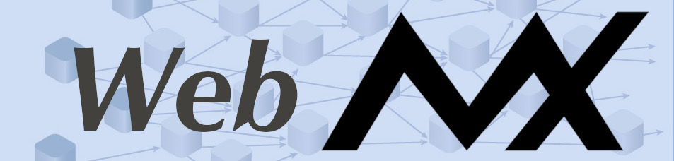

# Examples and Samples for...



[](https://clojars.org/com.tiltontec/web-mx)

[Web/MX](https://github.com/kennytilton/web-mx) makes Web programming insanely simple, thanks mostly to the [Matrix](https://github.com/kennytilton/matrix/blob/main/cljc/matrix/README.md) state manager. 

If curious about the Web/MX D/X, check out the [Web/MX Quick Start](https://kennytilton.github.io/web-mx-quickstart/#/). That gets into how the Matrix reactive engine delivers "insanely simple".

This sampler then provides sundry examples to help folks get started with Web/MX. We like examples.

### Just Run Something&trade;

First, pick an example:
```
ls *.cljs.edn
```
As of this writing, we have these:
```
intro.cljs.edn
rxtrak.cljs.edn
simpleclock.cljs.edn
svg-examples.cljs.edn
ticktock.cljs.edn
todomvc.cljs.edn
```
All examples are set up to run via Figwheel, using just the lead filename, eg:
```bash
clojure -M -m figwheel.main --build ticktock --repl
```
For convenience, we have this in our shell init:
```bash
figo () {
    echo "figwheel running $1"
    clojure -M -m figwheel.main --build $1 --repl
}
```
Then we can just type `figo ticktock`.

After a minute or so the `ticktock` example should appear in your browser at `http://localhost:9500/ticktock.html`, leaving a CLJS REPL in the original terminal.

### License

Copyright © 2016 Kenneth Tilton

Distributed under the Eclipse Public License either version 1.0 or (at your option) any later version.
